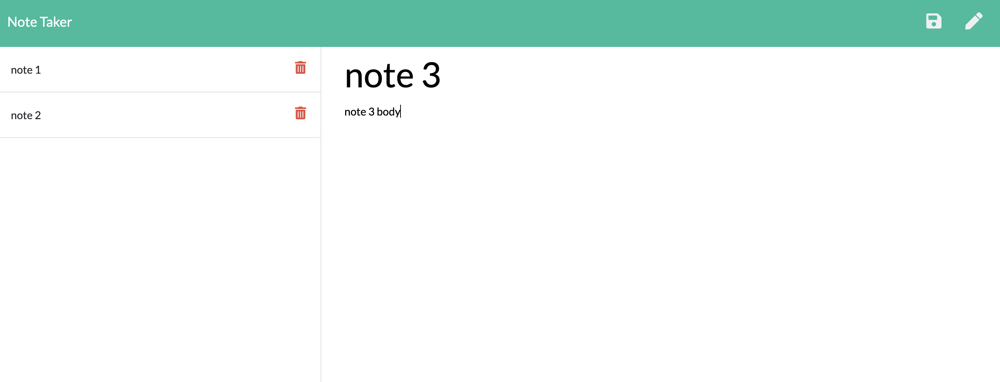

# Project Name: Note Taker App

## Author: grburner

  

## Table of Contents
<!--ts-->
1. [ Project Description ](#desc)
2. [ Installation Instructions ](#inst)
3. [ Usage Information ](#use)
4. [ Contribution Guidelines ](#guide)
5. [ Test Instructions ](#test)
6. [ License Type ](#l-type)
7. [ Questions | Email me ](#email)

<!--te-->

## 1. Project Description

A simple notes app built on Node and Express

## 2. Installation Instructions

 The app can be found live at https://dry-beyond-85922.herokuapp.com/. You can also download the git respoitory and run the app with 'node app.js'

## 3. Usage Information

 Create, Delete and Save notes on the application interface. Run on the Heroku URL or on your local server.

## 4. Contribution Guidelines

 Please feel free to start a pull request to suggest any changes.

## 5. Test Instructions

 There is no testing currently set up.

## 6. License Type

 Licensed under the [MIT](license/mit.txt) license.

## 7. Questions? Email me @:

[grburner@gmail.com](mailto:grburner@gmail.com) or find me on [GitHub](https://github.com/grburner)
